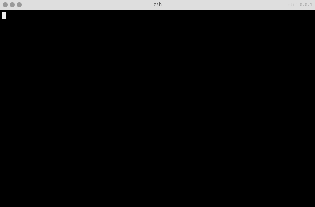

# Ehlo SMTP Server

[](https://npmjs.org/package/ehlo)
[](http://opensource.org/licenses/MIT)
[](https://npmjs.org/package/ehlo)

[](https://travis-ci.org/ehlo-io/ehlo)
[](https://coveralls.io/r/ehlo-io/ehlo?branch=master)
[](https://www.codacy.com/public/ehlo-io/ehlo.git)
[](https://codeclimate.com/github/ehlo-io/ehlo)

[](https://david-dm.org/ehlo-io/ehlo) 
[](https://david-dm.org/ehlo-io/ehlo#info=devDependencies)
[](https:/david-dm.org/ehlo-io/ehlo#info=peerDependencies)

> `Ehlo` is a SMTP server which send every mails to an api in a nice json format

## Install

```bash
npm i -g ehlo
```

## Using It
```
ehlo -p 10025 -a http://localhost/myAwesomApi
```

Now send a mail with your favorite lib (like `nodemailer`) with `localhost:10025` as SMTP server.

Your mail will be send with a POST request to `http://localhost/myAwesomApi`. All the json is posted in a `mail` form-data variable.

Here a tcpdump of a POST request :
```
13:41:45.987903 IP 127.0.0.1.52340 > 127.0.0.1.80: Flags [P.], seq 1:274, ack 1, win 12759, options [nop,nop,TS val 756661265 ecr 756661265], length 273
E..EP!@.@............t.P8...:jef..1..9.....
-...-...POST / HTTP/1.1
host: localhost
content-type: multipart/form-data; boundary=--------------------------511395648416127300743092
content-length: 249
Connection: close

----------------------------511395648416127300743092
Content-Disposition: form-data; name="mail"

13:41:45.987961 IP 127.0.0.1.52340 > 127.0.0.1.80: Flags [P.], seq 274:422, ack 1, win 12759, options [nop,nop,TS val 756661265 ecr 756661265], length 148
E...%.@.@............t.P8...:jef..1........
-...-...{"text":"Just an example\n","headers":{"subject":"Try"},"subject":"Try","priority":"normal"}
```

You can also store emails to disk with the `--save [path]` or `-s [path]` option.


For more informations about the json results, look at the [mailparser](https://github.com/andris9/mailparser) library.

## Setting DNS
If you want to receive *real* emails on your api, you should setup your **DNS RECORDS**.
For example, if you want to receive emails at `*@example.com`.

- An MX Record: `example.com MX 10 mx.domain.com`
- A a record: `mx.subdomain A <ip of your ehlo server>`

## Contributing

Provide a pull request (with tested code) to include your work in this main project. Issues may be awaiting for help so feel free to give a hand, with code or ideas.

## License
Ehlo is under the MIT license. Please see 
[`LICENSE`](LICENSE)
